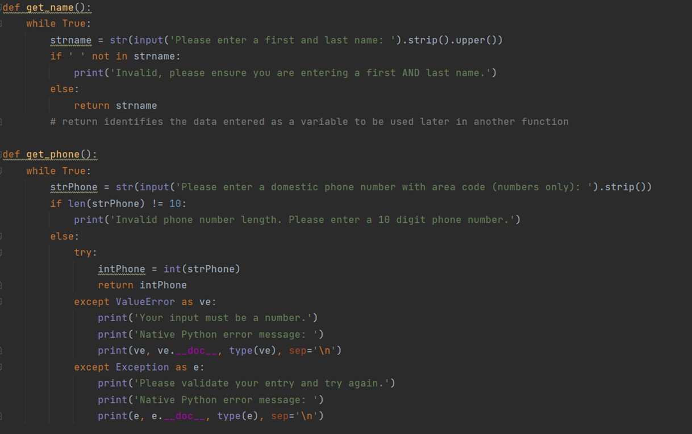

IMarshall

02/27/2023

IT FDN 110 A

Assignment 07

Github Repository: [IMarshallUW/IntroToProg-Python-Mod07: Files and Exceptions (github.com)](https://github.com/IMarshallUW/IntroToProg-Python-Mod07)

Github Webpage: [IntroToProg-Python-Mod07 Files and Exceptions (imarshalluw.github.io)](https://imarshalluw.github.io/IntroToProg-Python-Mod07/)

# Assignment 07 – Files and Exceptions

## Introduction

This module we were challenged to write our code in a instructional format to simulate introducing pickling and exception handling to someone unfamiliar to the concepts, and then wrapping both those concepts together using functions. We chose to separate the code into three separate file so they could be built on to introduce new concepts and make them more of a finished product as we went. In this paper we will go over each of those files individually.

## File: Assignment07_01 Pickling

To begin, after the title block and declaring our variables we begin each file with a description of the topic we’ll be covering in the hopes of giving the student some background on what they’ll be learning in the script and maybe why it would be used. The first topic to cover was pickling. 

Pickling is a function that converts any Python object (list, dict, etc.) to and from binary. This allows for easier transfer between databases to then be stored in a file or database. We started with the import pickle command which lets the program know that at some point in the script it will importing binary code from another file. We then used a very basic code to obtain a customer name and phone number and add them to a list in memory. Followed by the use of the pickle.dump and how it works, explaining that it still writes the code to a file, just an extra bit of code to tell the program to write it as binary. To close out the program we use the pickle.load command to read the code in the file and show it to the user, but highlight that that command will only show a single row (figure 01). In the next file we will show how to make the command more complex to read the whole file.

*Figure 1: Assignment07_01 Pickling script*

## File: Assignment07_02 Exception Handling

In the next file we built on our first bit of code to add some minor complexities and introduce the concept of exception handling. We started with the same style of introduction block as before to explain that exception handling is the use of a try/catch block that will return the user back to a certain point in the program if an exception is encountered instead of breaking and ending the program.

To start building on our code we showed the student how to use a while loop to help ensure that the user enters a first and last name as instructed by checking for a space in their entry (figure 2). We then proceeded to discuss how in the previous program, there was no enforcement or check on if the phone number that was entered was a complete ten digit phone number and that if letter or other non-number value was entered the program would break (figure 3). So we showed the student how to use a while loop to check the character length to ensure that the phone was long enough to be a full seven digit phone number with a three digit area code. Then once the length was correct we used a try block to convert the string into an integer. Whereas before the program would break and kick the user out if the entry contained anything that wasn’t a number, now the user is presented with a error message by our own design as well as the native Python error message and sent back to the beginning of the while loop to try again (figure 4).
 

*Figure 2: Assignment07_02, validating user entered first AND last name*

*Figure 3: Assignment 07_02, program breaks if non-integer is entered*

*Figure 4: Assignment07_02, check for phone number length and exception handling to prevent program failure if non-integer entered*

The last part of the code that we changed allows the pickle.load function to read all the data in our file instead of just a single line. We accomplished this by showing the student that the pickle.load function could be combined with a while loop combined with a try/catch block. The try statement tells the program to read and print the first line in the file with no break statement on success. This make it repeat the loop and read the next line. It will continue this until there is no more data and it receiving a EOFError, or end of data error. Which will then break the loop (figure 5).
 

*Figure 5: Assignment07_02, while loop to use pickle.load for all lines in file*

## File: Assignment07_03 Using Funcitons

The final file took the expanded code we had just written and showed how we could do the same thing using functions. We started Assignment07_03 by splitting our data entry into two distinct input/output functions for the customer name and phone number, and a separate save function. We added an .upper() the name entry for conformity of the data, and a return statement at the end of our input/output functions so the data entered became variables to be used by our save function. We also added a print statement to show the user what they had just entered. Other than those small adjustments the code is identical to what we wrote in Assignment07_02 (figure 6 & 7).
 

*Figure 6: Assignment07_03, get_name and get_phone functions*
 

*Figure 7: Assignment07_03, save_customer function*

Our script to read the file remained the same entirely other than being defined as a function (figure 8). And finally we defined a menu that would act as the user interface. Which we used an if statement with to show the menu if the program were opened directly from file. Otherwise the menu would not be shown. This allows for other programmers to import our code and utilize our functions without forcing our interface (figure 8). To make it easier for the student to see how the code was changed the code from Assignment07_02 is at the bottom of the script, commented out, with notes on how it was parsed out to make our functions in the hopes of demonstrating that once the script is written it can be converted into functions fairly easily with a plan.
 

*Figure 8: Assignment07_03, user menu and if statement*

## Conclusion

In this paper we showed how used commented out verbiage in a program script to instruct someone on how to write a script to work with pickling for handling binary. We then built on that program to add some constraints and demonstrate exception handling. Finally, we again built on that script to perform all the things that we learned using functions. As always reference below for our three scripts running in Command Prompt (figure 9 & 10).
 

*Figure 9: Run in command prompt*
 

*Figure 10: Run in command prompt cont*

